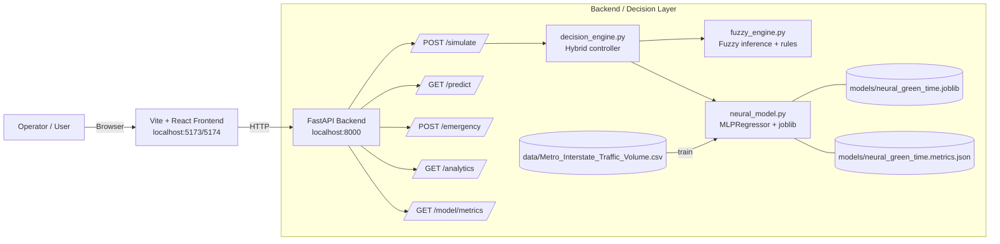
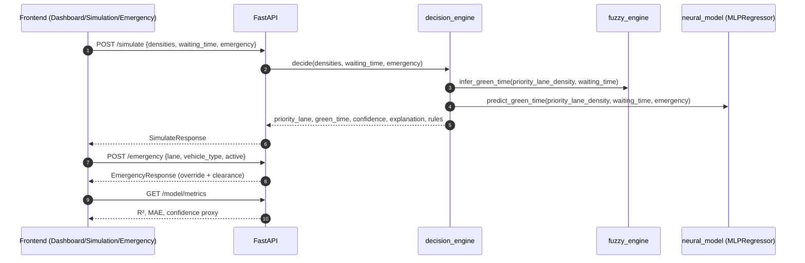

# 🚦 NeuroFlow

**NeuroFlow: Intelligent Traffic Control System using Neuro‑Fuzzy Logic** — a futuristic smart‑city dashboard + a FastAPI decision engine that optimizes green signal time using **Fuzzy Logic + a trained ANN** (MLPRegressor trained on the UCI “Metro Interstate Traffic Volume” dataset).

---

## 🚀 Features

### 🎯 Core features
- **Real-time traffic dashboard** (4‑way intersection)
- **Simulation engine** (density + waiting time + emergency flag)
- **Neuro‑Fuzzy decision system** (rule-based inference with explainability)
- **Trained neural model (ANN)** using a real dataset (MLPRegressor + joblib)
- **Hybrid controller**: \(final = 0.6 \cdot fuzzy + 0.4 \cdot neural\)
- **Emergency override** (corridor preemption + global UI state)
- **Analytics + model metrics** (efficiency, average wait, confidence, R²/MAE)
- **AI-powered camera feeds (simulated)** with bounding boxes + scanlines
- **Light/Dark theme** with premium UI micro-interactions

### 🧠 Explainability
The backend returns:
- **`triggered_rules`**: which fuzzy rules fired (with activation values)
- **`confidence`**: a heuristic confidence score (0–100)
- **`explanation`**: human-readable reason string

### 🎥 Simulated AI camera monitoring
- **4 feeds** (North/South/East/West)
- **Detections** derived from density: `density / 25` bounding boxes
- **Labels** like “Car 92%”, “Bus 87%”
- **REC ● LIVE**, timestamp, scan line, noise/grain overlay

---

## 🏗️ Architecture

### Repository layout

| Path | Role |
|------|------|
| `frontend/` | Vite + React 18 + Tailwind CSS v4 + React Router 7 + Recharts + Motion |
| `backend/` | FastAPI + Neuro‑Fuzzy + trained ANN (MLPRegressor) |

### System architecture diagram



### Request/response flowchart



---

## 🛠️ Tech stack

### Frontend
- **React 18** + **Vite**
- **Tailwind CSS v4**
- **React Router**
- **Recharts** (charts)
- **Motion** (animations)
- **Plotly (lazy-loaded)** for true **3D surface plot** in Analysis

### Backend
- **FastAPI**
- **Fuzzy inference engine** (membership functions + rule base)
- **scikit‑learn MLPRegressor** (trained neural model)
- **pandas** preprocessing
- **joblib** model persistence

---

## 🚀 Getting started

### Prerequisites
- Node.js 18+
- Python 3.11+

### Frontend

```bash
cd frontend
cp .env.example .env
npm install
npm run dev
```

Frontend: `http://localhost:5173` (or next available port)

### Backend

```bash
cd backend
python -m venv .venv
source .venv/bin/activate   # Windows: .venv\Scripts\activate
pip install -r requirements.txt
uvicorn app.main:app --reload --port 8000
```

Backend: `http://localhost:8000` · Docs: `http://localhost:8000/docs`

> If your frontend runs on `5174`, ensure `CORS_ORIGINS` includes it (see `backend/.env.example`).

---

## ⚙️ Environment variables

### Frontend
`frontend/.env`

```bash
VITE_API_URL=http://localhost:8000
```

### Backend
`backend/.env` (optional, copy from `.env.example`)

```bash
CORS_ORIGINS=http://localhost:5173,http://127.0.0.1:5173,http://localhost:5174,http://127.0.0.1:5174
NEUROFLOW_TRAIN_ON_STARTUP=0
```

---

## 📊 API endpoints

| Method | Path | Purpose |
|--------|------|---------|
| POST | `/simulate` | Hybrid neuro‑fuzzy + ANN green time + rules + confidence |
| GET | `/predict` | Short-horizon congestion forecast (demo series) |
| POST | `/emergency` | Emergency corridor override (preemption) |
| GET | `/analytics` | KPI snapshot (includes model confidence proxy) |
| GET | `/model/metrics` | ANN model metrics (R², MAE, confidence proxy) |

---

## 🧪 Model training (real dataset)

1) Place the UCI dataset CSV in `backend/data/` (required columns: `traffic_volume`, `date_time`)

2) Train and save:

```bash
cd backend
source .venv/bin/activate
python -m app.services.neural_model --train
```

Artifacts:
- `backend/models/neural_green_time.joblib`
- `backend/models/neural_green_time.metrics.json`

The API loads the model at startup if present.

---

## 🧰 Development

### Backend tests

```bash
cd backend
source .venv/bin/activate
pytest -q
```

### Frontend build

```bash
cd frontend
npm run build
```

---

## 🗺️ Roadmap

- ✅ **Phase 1–2**: Figma UI, routing, Vite + Tailwind
- ✅ **Phase 3–5**: FastAPI endpoints + neuro‑fuzzy + hybrid integration
- ✅ **Phase 6**: Real dataset training (MLPRegressor) + model persistence
- ✅ **Phase 7**: Premium dashboard polish + AI camera simulation + shared global state
- 🔜 **Next**: persistence/logging, richer analytics, real sensor adapters

---

## 📄 License / attributions

See `frontend/ATTRIBUTIONS.md` and third‑party notices in the Figma export.
