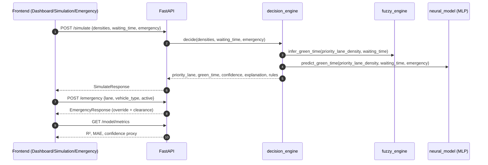

# NeuroFlow: Intelligent Traffic Control System using Neuro-Fuzzy Logic

Smart traffic control with a neuro-fuzzy decision engine and a React dashboard. The UI comes from a Figma export; the backend will expose simulation, prediction, emergency, and analytics APIs.

## Repository layout

| Path | Role |
|------|------|
| `frontend/` | Vite + React 18 + Tailwind CSS v4 + React Router 7 + Recharts + Motion |
| `backend/` | FastAPI (CORS ready for the Vite dev server) |

## System architecture

```mermaid
flowchart LR
  U[Operator / User] -->|Browser| FE[Vite + React Frontend<br/>localhost:5173/5174]

  FE -->|HTTP| API[FastAPI Backend<br/>localhost:8000]

  subgraph Backend[Backend / Decision Layer]
    API --> SIM[/POST /simulate/]
    API --> PRED[/GET /predict/]
    API --> EMR[/POST /emergency/]
    API --> ANA[/GET /analytics/]
    API --> MET[/GET /model/metrics/]

    SIM --> DEC[decision_engine.py<br/>Hybrid controller]
    DEC --> FZ[fuzzy_engine.py<br/>Fuzzy inference + rules]
    DEC --> NN[neural_model.py<br/>MLPRegressor (joblib)]

    NN --- MODEL[(models/neural_green_time.joblib)]
    NN --- METRICS[(models/neural_green_time.metrics.json)]
    DATA[(data/Metro_Interstate_Traffic_Volume.csv)] -->|train| NN
  end
```

## Request/response flowchart



## Prerequisites

- Node.js 18+ and npm
- Python 3.11+ (for the API)

## Frontend

```bash
cd frontend
npm install
npm run dev
```

Open [http://localhost:5173](http://localhost:5173). Production build:

```bash
npm run build
npm run preview
```

## Backend

```bash
cd backend
python -m venv .venv
source .venv/bin/activate   # Windows: .venv\Scripts\activate
pip install -r requirements.txt
uvicorn app.main:app --reload --port 8000
```

API: [http://localhost:8000](http://localhost:8000) · OpenAPI: [http://localhost:8000/docs](http://localhost:8000/docs)

Optional: copy `backend/.env.example` to `backend/.env` and adjust `CORS_ORIGINS`.

## Phase 6: Real dataset training (neural model)

- **Put the UCI CSV** in `backend/data/` (required columns: `traffic_volume`, `date_time`).
- Train and save the model:

```bash
cd backend
source .venv/bin/activate
python -m app.services.neural_model --train
```

This writes:
- `backend/models/neural_green_time.joblib`
- `backend/models/neural_green_time.metrics.json`

On API startup, the model is **auto-loaded** if present. To auto-train on startup (not recommended for production):

```bash
export NEUROFLOW_TRAIN_ON_STARTUP=1
uvicorn app.main:app --reload --port 8000
```

## API (Phases 3–5)

| Method | Path | Purpose |
|--------|------|---------|
| POST | `/simulate` | Hybrid neuro-fuzzy + neural green time, explanation, rules |
| GET | `/predict` | Short-horizon congestion forecast |
| POST | `/emergency` | Emergency corridor override |
| GET | `/analytics` | Mock KPI snapshot |

Frontend reads **`VITE_API_URL`** (default `http://localhost:8000`). Copy `frontend/.env.example` to `frontend/.env`.

**Tests:** from `backend/`, run `pytest`.

## Roadmap (from PRD)

- **Phase 1–2:** Figma UI, routing, FastAPI skeleton — done.
- **Phase 3–5:** Neuro-fuzzy engine, neural blend, routes, frontend `src/services/api.ts` — done.
- **Next:** Phase 6–7 polish, logging, optional real sensors.

## License

See `frontend/ATTRIBUTIONS.md` and third-party notices in the Figma export.
